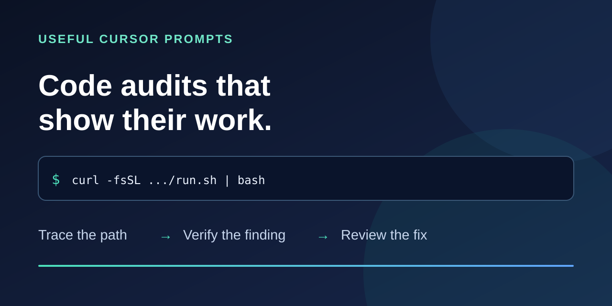

# Codebase Audit

[](https://github.com/samjhill/codebase-audit/actions/workflows/ci.yml) [](LICENSE)

**One command. A reviewable branch. Evidence before confident-sounding advice.**

Codebase Audit asks Cursor, Codex, or Claude Code to trace a repository's real behavior, reproduce important failures safely, apply small fixes it can verify, run available checks, and write `.code-audit/report.md`. Run it once locally or schedule a weekly pull request. It also includes 25 focused prompts for deeper investigations.

> A green test can mean a fixture passed while the live path broke. A queued job can be called “done” before a customer sees anything. This project asks where the outcome actually becomes true.

[See a real finding in this repository](docs/self-audit.md) · [Read the design principles](DESIGN.md) · [Browse the prompts](#pick-an-audit)

## Run once

Install and sign in to the [Cursor CLI](https://cursor.com/docs/cli/installation), [Codex CLI](https://learn.chatgpt.com/docs/codex/cli), or [Claude Code CLI](https://code.claude.com/docs/en/setup). From the root of a **clean Git repository** you want to audit:

```bash
curl -fsSL https://raw.githubusercontent.com/samjhill/codebase-audit/main/run.sh | bash
```

The runner selects the first available CLI in this order: Cursor → Codex → Claude. To choose one explicitly, append `-s -- --agent claude` (or `cursor` or `codex`) to the command. It creates an `audit/*` branch, keeps code changes there, and asks the agent for a report. **Review the diff and report before merging.** The agent can execute commands and edit files; your plan limits or API charges apply.

```text
your repository
    ├── audit/* branch             ← reviewable edits
    └── .code-audit/report.md      ← findings, evidence, checks, unknowns
```

The runner fails if the agent exits with an error or omits a nonempty report. A successful exit means the CLI returned zero and wrote a report; it does not establish that every finding or fix is correct. The [runner contract tests](tests/test_runner.py) use disposable repositories and stub CLIs; earlier Cursor and Codex smoke runs fixed a seeded bug. A live Claude run and the scheduled workflows still need validation with your own credentials.

## Run periodically

Copy the [Cursor workflow](examples/periodic-audit.yml) or [Claude workflow](examples/periodic-audit-claude.yml) into the repository you want to audit as `.github/workflows/audit.yml`. Add `CURSOR_API_KEY` or `ANTHROPIC_API_KEY` as the corresponding GitHub Actions secret. In **Settings → Actions → General → Workflow permissions**, enable **Allow GitHub Actions to create and approve pull requests**.

The example runs weekly or on manual dispatch and opens a PR only when code changes. Review every PR before merging. Scheduled runs consume agent API usage and GitHub Actions minutes. [Cursor Automations](https://cursor.com/docs/cloud-agent/automations) are another option for focused audits.

## What makes a finding useful

| Question | Required evidence |
| --- | --- |
| What failed? | The entry point, state transition, and intended user outcome |
| Why believe it? | Exact code path and a safe reproduction or clearly labeled inference |
| What changed? | The smallest practical fix and a reviewable diff |
| What passed? | Checks labeled unit/fixture, integration, staging, or live; mocked dependencies named |
| What remains unknown? | Missing telemetry, credentials, provider behavior, or manual verification |

The [self-audit](docs/self-audit.md) follows this pattern for a real runner failure. The [operational truth prompt](code/operational-truth.md) applies it to a product's customer outcome.

## Pick an audit

Open a prompt in Cursor, Codex, or Claude Code and fill in its bracketed placeholders. Focused prompts start with investigation; sensitive billing and security prompts are read-only.

| If you need to… | Start here |
| --- | --- |
| Find a broken customer flow | [Customer journey](customer/customer-journey-audit.md) |
| Catch misleading success signals | [Operational truth](code/operational-truth.md) |
| Check whether onboarding is truly ready | [Onboarding readiness](customer/onboarding-readiness-audit.md) |
| Trace subscription and payment state | [Billing lifecycle](code/backend/billing-lifecycle-audit.md) |
| Investigate security exposure | [Evidence-based security audit](security/security-audit.md) |
| Find expensive or fragile infrastructure | [Infrastructure](code/infrastructure.md) |
| Remove unused code | [Dead code](code/dead-code.md) |
| Reduce CI time or cost | [GitHub Actions CI cost](code/github-actions-ci-cost.md) |

<details>
<summary>All 25 focused prompts</summary>

**Investigate first:** [customer journey](customer/customer-journey-audit.md) · [onboarding readiness](customer/onboarding-readiness-audit.md) · [billing lifecycle](code/backend/billing-lifecycle-audit.md) · [security audit](security/security-audit.md) · [infrastructure](code/infrastructure.md)

**Cross-cutting code:** [operational truth](code/operational-truth.md) · [boundaries](code/boundaries.md) · [dead code](code/dead-code.md) · [dependencies](code/dependencies.md) · [naming](code/naming-clarity.md) · [type safety](code/type-safety.md) · [complexity](code/complexity.md) · [state ownership](code/state-ownership.md) · [edge cases](code/edge-case.md) · [test suite](code/test-suite.md) · [performance](code/performance.md) · [engineer onboarding](code/engineer-onboarding.md) · [CI cost](code/github-actions-ci-cost.md)

**Frontend:** [code cleanup](code/frontend/frontend-code-cleanup.md) · [logic cleanup](code/frontend/frontend-logic-cleanup.md) · [accessibility](code/frontend/a11y.md)

**Backend:** [code cleanup](code/backend/backend-code-cleanup.md) · [logic cleanup](code/backend/backend-logic-cleanup.md) · [logging](code/backend/logging.md)

The older [code security pass](code/security-audit.md) is a shorter fix-oriented checklist.

</details>

## Limits and contribution

These are prompts and an agent runner, not a deterministic scanner or a security certification. A plausible finding is not a verified bug. Repo access cannot establish what happened in production; fixtures cannot prove live acceptance. High-risk changes need human review and safe validation. A codebase-wide pass cannot guarantee it found or fixed every bug.

This project reflects the engineering approach of [Sam Hill](https://github.com/samjhill). Concrete counterexamples and false positives are especially useful: [open an issue](https://github.com/samjhill/codebase-audit/issues) or [contribute a prompt improvement](CONTRIBUTING.md). Licensed under [MIT](LICENSE).
